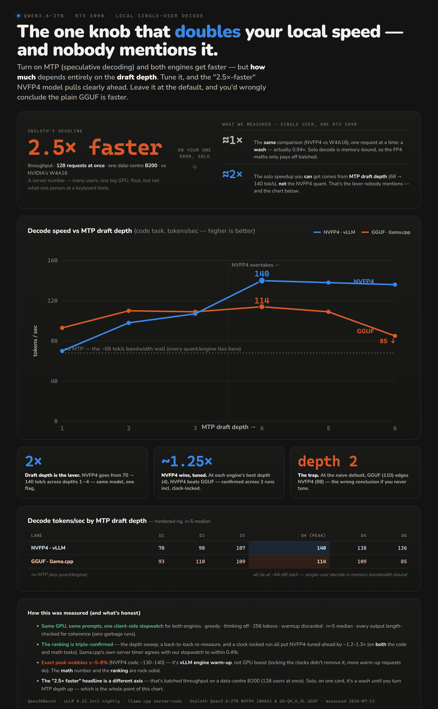

# Qwen36 Arena — NVFP4 vs GGUF on one GPU, honestly

Race Unsloth's **NVFP4** Qwen3.6-27B (on **vLLM**) against the **GGUF** you already run (on **llama.cpp**) — same model, same prompts, one client-side stopwatch, one consumer GPU. Then sweep the one knob that actually decides the winner: **MTP draft depth**.

Built for a video by [The AI Automators](https://www.youtube.com/@TheAiAutomators); published so anyone can reproduce the numbers. Tested 2026-07-13 on an **RTX 5090 (32 GB)**, Docker Desktop/WSL2, `vllm/vllm-openai:nightly` (`0.23.1rc1.dev1060`) and `ghcr.io/ggml-org/llama.cpp:server-cuda`.



## The finding in one line

Unsloth's headline **"2.5× faster"** is a *batched-server* number (128 requests at once, on a B200, vs NVIDIA's W4A16). For **one person on one 5090**, the same quant-vs-quant comparison is a **wash** — every lane hits the same ~68 tok/s memory-bandwidth wall. The solo speedup you *can* get comes from **MTP (multi-token prediction) draft depth**, and it rewards NVFP4 far more than GGUF: tuned to each engine's best depth, **NVFP4+MTP wins ~1.2–1.3×** — the *reverse* of what a naive depth-2 test shows.

## What you get

- **Live race dashboard** (`http://localhost:8870`) — each lane streams its tokens into its own pane; **Replay side-by-side** re-runs everything recorded at true speed. Records to disk, survives refreshes and lane swaps.
- **Scripted A/B battery** (`bench.py`) — one client-side clock for *both* engines (no engine's self-reported throughput is trusted, only its token count), greedy, thinking off, 256 tokens, with **warmup discard · n-of-N median · a degeneration gate** (fast-but-garbage output can't inflate tok/s).
- **The hardened test suite** — `rerun_depth_sweep.py` (MTP depth 1–6 on both engines + an A-B-A thermal-drift bookend), `confirm_peak.py` (a tight back-to-back peak re-measure), and `analyze_rerun.py` (prints the per-depth curve, each engine's best depth, and the head-to-head verdict). This is what turned a wrong depth-2 headline into the corrected finding.
- **Three lanes, one launcher** — `nvfp4` (Unsloth W4A4, vLLM), `w4a16` (NVIDIA's checkpoint — the 2.5× claim's own baseline, vLLM), `gguf` (Unsloth UD-Q4_K_XL, llama.cpp) — all served under one name (`qwen36`) on an OpenAI-compatible API, so the bench/dashboard/your agent never care which is up.

## Requirements

- **GPU:** the **NVFP4 lanes need Blackwell** (RTX 50-series / DGX Spark GB10 / B200 / B300) — W4A4 runs on FP4 tensor cores. The **GGUF lane runs on any CUDA GPU**. **32 GB VRAM** (RTX 5090) runs the 27B lanes as-is; the 35B-A3B MoE lanes also fit. Up-to-date host driver (the containers bring their own CUDA).
- **Software:** Docker (Desktop + WSL2 backend on Windows · Engine + `nvidia-container-toolkit` on Linux) · `git` · any **Python 3** on the host for the bench/suite (stdlib only). No Hugging Face account or API keys — the models are public.
- **Disk:** ~130 GB for the full model set (27B + 35B, NVFP4 + GGUF + baseline) into a shared Docker volume — or just the 27B lanes (~70 GB) for the headline finding. Plus ~28 GB vLLM image + ~4 GB llama.cpp image.

## Quickstart

```bash
# Linux/macOS                              # Windows (terminal or double-click)
./setup.sh                                 setup.cmd
./qwen36.sh download    # models, once     qwen36.cmd download
./qwen36.sh nvfp4 27b mtp 4   # serve      qwen36.cmd nvfp4 27b mtp 4   ->  http://localhost:8000/v1
./qwen36.sh dash        # dashboard        qwen36.cmd dash              ->  http://localhost:8870
./qwen36.sh bench       # battery          qwen36.cmd bench
```

One model on the GPU at a time (27B lanes each reserve ~30 GB). Swap lanes with `stop` → serve the next → race the same prompt → **Replay** in the dashboard.

**Reproduce the headline (the MTP depth sweep):**

```bash
python3 rerun_depth_sweep.py     # serves nvfp4 & gguf at MTP depths 1–4 + drift bookend, ~25 min
python3 analyze_rerun.py         # -> per-depth curve, best depth per engine, the verdict
```

## Measured results (RTX 5090, single user, greedy, 256 tokens, n=5 median)

**MTP draft depth sweep — decode tok/s, code task:**

| MTP depth | 1 | 2 | 3 | **4 (peak)** | 5 | 6 |
|---|---|---|---|---|---|---|
| **NVFP4** · vLLM | 70 | 98 | 107 | **140** | 138 | 136 |
| **GGUF** · llama.cpp | 93 | 110 | 109 | **114** | 109 | 85 |

- **No MTP:** every lane (NVFP4 W4A4, NVIDIA W4A16, GGUF Q4) ties at **~64–68 tok/s** — single-user decode is memory-bandwidth-bound, so the quant flavour barely moves it. NVFP4-vs-W4A16 solo is **0.94×** (a wash; the "W4A4" checkpoint is actually ~7% heavier in VRAM).
- **MTP is the lever**, and the two engines respond completely differently: NVFP4 **rewards deep speculation** (2×, 70→140 across depths 1→4); GGUF **saturates early** (~110–114) then **degrades** past depth 4 (85 at depth 6).
- **At depth 2** (the naive default) GGUF edges NVFP4 (110 vs 98) — the trap. **At each engine's best depth (4), NVFP4 wins ~1.2–1.3×** (confirmed across the sweep, a back-to-back re-measure, and a clock-locked run; llama.cpp's own server timer agrees with our stopwatch to ≤0.4%).

Full methodology, the red-team that caught the depth-2 artifact, and the on-camera-honest framing: **[docs/METHODOLOGY.md](docs/METHODOLOGY.md)**.

## Honest caveats

- **Single-user, batch-1 numbers.** The whole rig measures what one person at a keyboard feels. Unsloth's "2.5×" is *batched throughput* (128 concurrent, on a B200, vs W4A16) — a real but different axis. Solo, the quant is a wash; MTP depth is the win.
- **Exact peaks wobble ±5–8%** — it's vLLM **engine warm-up** (the first requests ramp as CUDA graphs / autotune settle), not GPU boost. Locking clocks didn't remove it; a warmup discard + median does most of it. The *ranking* and the *math-task* numbers are rock-solid.
- **Greedy (temp 0).** For predictable output (code/math) the MTP speedup is temperature-insensitive; open chat decays with temperature. Serve is thinking-off (Unsloth recommends ~temp 0.7 there).
- **Nightly tooling.** vLLM NVFP4 + spec-decode is a nightly (its startup even warns it can't full-graph spec-decode with FlashInfer yet). Numbers reflect the pinned image tags; nightlies move.
- The dashboard binds `0.0.0.0:8870` with no auth — local use.

## Layout

| path | what |
|---|---|
| `setup.(sh\|cmd)` | create the `qwen36-hf` model volume |
| `qwen36.(sh\|cmd)` | the launcher: `nvfp4 / w4a16 / gguf [27b\|35b] [mtp N]` · `dash` · `bench` · `download` · `status` · `stop` |
| `racer.py` | the shared measuring stick — streams the OpenAI API, times it client-side (both engines, one clock) |
| `bench.py` | scripted battery: `--warmup` · `--stat best\|median\|mean` · `--temp` · `--save-text` · degeneration gate |
| `dash/serve.py` + `dash/index.html` | race dashboard (records → replays side-by-side) |
| `rerun_depth_sweep.py` · `confirm_peak.py` · `analyze_rerun.py` | **the hardened test suite** — depth sweep, A-B-A confirm, verdict |
| `download_models.py` | priority-ordered prefetch (27B lanes first) into the volume |
| `mock_lane.py` | a fake OpenAI lane for testing the rig without a GPU |
| `results/sample-*.json` | our actual measured numbers (reference) |
| `docs/METHODOLOGY.md` · `docs/depth-report.html` | full methodology + the on-screen report |

## Licenses & attribution

This repo (launcher, dashboard, bench harness, test suite): **MIT** © The AI Automators. Model weights — [Unsloth Qwen3.6 NVFP4 & GGUF](https://huggingface.co/unsloth), [NVIDIA Qwen3.6-27B-NVFP4](https://huggingface.co/nvidia/Qwen3.6-27B-NVFP4) — download from Hugging Face under their own licenses. [vLLM](https://github.com/vllm-project/vllm) and [llama.cpp](https://github.com/ggml-org/llama.cpp) are pulled as their published Docker images, unmodified.
